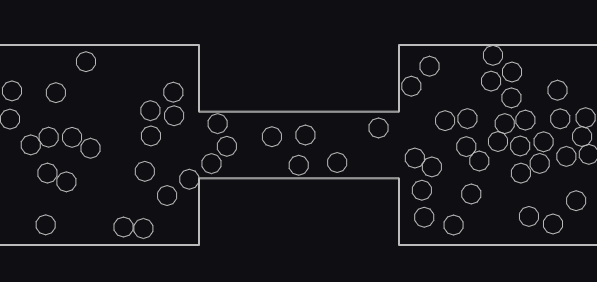

# HeatSimulation
A simulation of heat transfer using bouncing balls in a container

[README em português](README.pt-br.md)

[Watch it!](https://heatsimulation.netlify.app/)

The bouncing balls simulate the molecules of a material. How fast they are moving is an analogy to heat. The left container starts with the balls moving fast, while the right container starts with its balls stopped. Over time, the molecules from the left container hit the ones from the right container and they start moving too, as if heat had been transfered between them. After some time both container's molecules move equally as fast, representing thermal equilibrium.

The physics engine used is Matter.js
